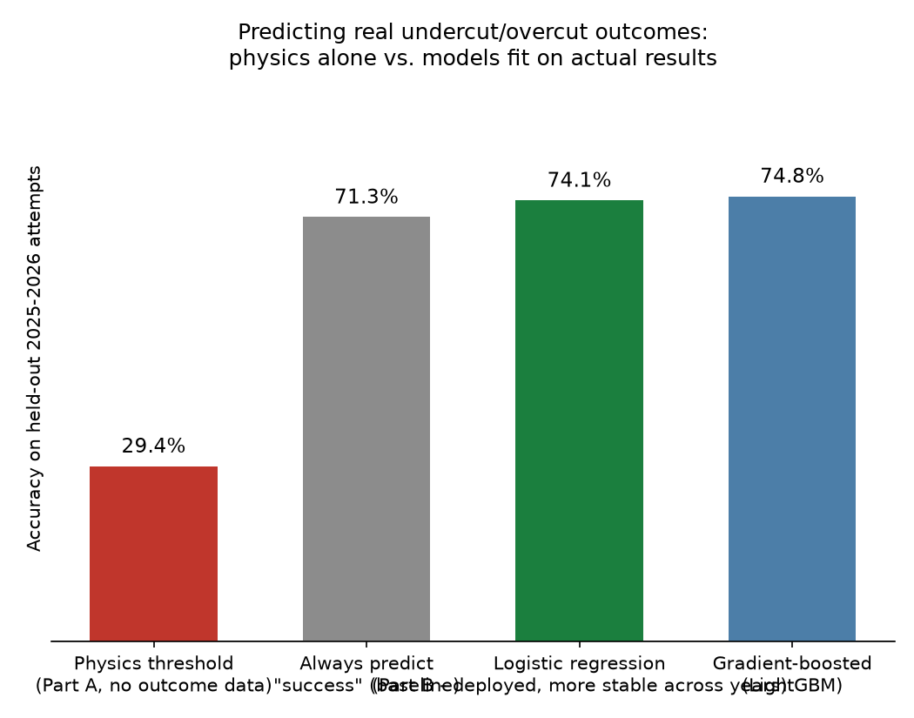
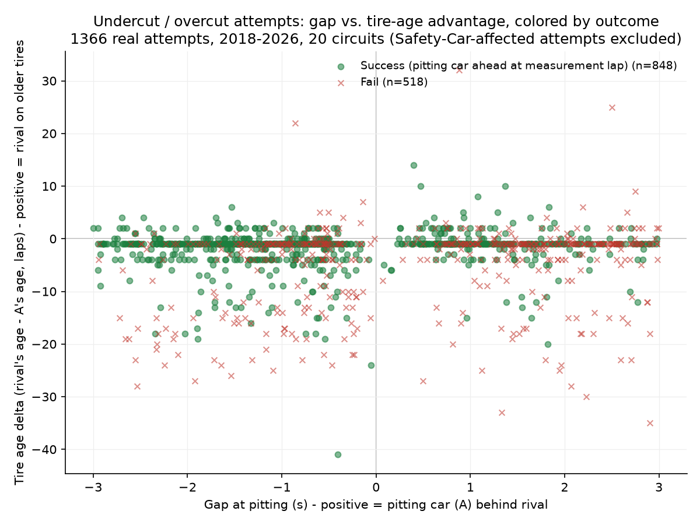
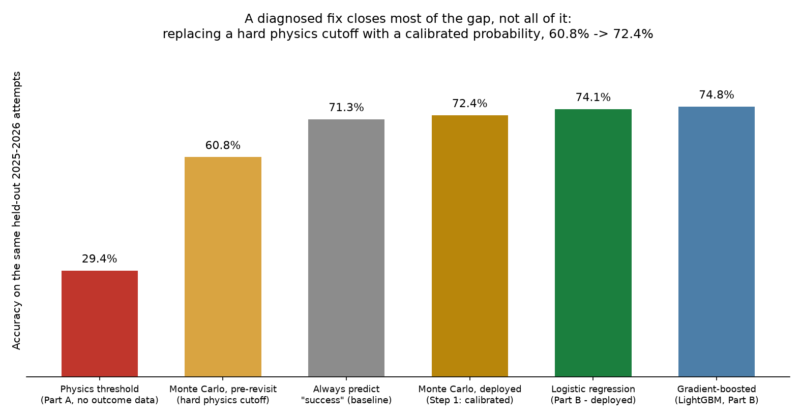

# Does pitting now actually gain track position? A data-driven F1 strategy tool

## Abstract

Race strategists face one recurring question: if I pit right now, does it actually gain me
track position against the car next to me? I built a decision-support tool that answers this
from real outcomes rather than tire-degradation physics alone, using 150 real Formula 1 races
(2018-2026, 20 circuits, pulled from the FastF1 API) and 2,444 detected undercut/overcut
attempts. A physics-only rule scores 29.4% accuracy on held-out 2025-2026 attempts - worse than
simply guessing "success" (71.3%) - while a logistic regression fit on the real outcomes reaches
74.1% accuracy (AUC 0.765; 72.3% ± 1.4% under cross-validation). The gap between the two is the
real finding: track position in F1 is far stickier than lap-time math suggests. The tool is
built to be used before or during a race weekend to sanity-check a pit call, and every number in
this paper is reported with its honest validation, including where the approach falls short.

## 1. Introduction

A race engineer watching a rival close to 1.5 seconds has seconds to decide: pit now, wait, or
let it go. Most public F1 data projects predict who wins the race - a fun exercise, but not the
decision a strategist actually makes lap to lap. This project asks the narrower, harder question
a real strategy team asks: **does pitting now gain or lose track position against the car next
to me, right now, in this exact situation?**

That's a materially different problem from race-winner prediction. It has a short, well-defined
time horizon (a handful of laps), a binary, checkable outcome (ahead or not, 3 laps after both
cars have stopped), and a "smart" null hypothesis that's easy to state and test: tire-degradation
physics. Testing that null hypothesis against real outcomes turned out to be the most
interesting part of the whole project.

## 2. Data

All data is public race telemetry and timing data - no private individuals, teams' internal
data, or proprietary feeds are involved anywhere in this project.

- **Source:** [FastF1](https://github.com/theOehrly/Fast-F1), a free, open Python library that
  exposes official F1 timing data per session.
- **Coverage:** the 20 most-raced circuits, 2018-2026, 150 races.
- **Core tables:** `laps.csv` (166,921 lap-level rows), `weather.csv` (22,781 rows),
  `race_control.csv` (14,498 flag/incident rows), `results.csv` (3,020 driver-race rows).
- **Derived training data:** 2,444 real undercut/overcut attempts detected directly from lap
  timing (two cars within 3 seconds, one pitting before the other); 1,362 of these are "clean"
  (not affected by a Safety Car/VSC period) and used to fit the core model; 286 real 2025-2026
  attempts are held out entirely for testing.
- **What's excluded, and why:** Safety-Car-affected stops are excluded from the clean training
  set because pit-loss economics change completely under a Safety Car - mixing them in would
  blend two different physical situations under one label. Compound labels (SOFT/MEDIUM/HARD)
  are used as-is even though they are relative to each race weekend, not a fixed rubber compound
  across seasons - a known limitation, discussed in Section 6.

## 3. Methodology

**The label.** An "attempt" is driver A pitting on lap L_A while within 3 seconds of driver B,
where B pits on some later lap L_B. Success = A is ahead of B 3 laps after L_B. This rule was
fixed *before* looking at outcomes, to avoid retrofitting a definition to a convenient result.

**The baselines.** Two honest baselines, not just one: (1) always predict "success" (71.3% of
attempts succeed - a trivial, uninformative rule); (2) a physics-only threshold comparing the
fresh-tire pace gain against the gap-plus-pit-loss cost, using no outcome data at all.

**The model.** A logistic regression over 10 features: the gap at pitting, both cars' tire ages,
compounds, a team pit-crew-speed proxy (pit-lane transit time vs. that circuit's median), and a
gap × rival-tire-age interaction. A gradient-boosted model (LightGBM) was fit on the identical
features and split, as a direct capacity check (Section 6).

**Validation design.** All test numbers come from a strictly later time window than training
(2025-2026 attempts held out from 2018-2024 training) - no shuffled random split, which would
leak future information backward. Beyond the single held-out split, the model was additionally
checked with 3-fold **expanding-window cross-validation** (train on earlier seasons only, test
on a later season never seen), to catch a result that looks good only because of one lucky split.

**Leakage checks.** The gap and tire-age features are computed strictly from state available at
the moment of the decision (lap L_A), never from anything that happens afterward. The two
candidate new features that didn't hold up under testing (out-lap traffic, race-progress
fraction) were dropped rather than kept for a marginal single-split gain.

## 4. Results

| Approach | Accuracy | AUC |
|---|---|---|
| Physics-only threshold (no outcome data) | 29.4% | - |
| Always predict "success" (trivial baseline) | 71.3% | 0.50 |
| Logistic regression (deployed) | 74.1% (72.3% ± 1.4% CV) | 0.765 |
| LightGBM (gradient-boosted, capacity check) | 74.8% | ~0.76 |

*A physics-only rule is worse than guessing; a model fit on real outcomes gains 45 points over
physics and ~3 over the trivial baseline - the real gain is in AUC (0.50 → 0.765), not the
accuracy digit alone (see Section 6).*

The same real attempts, plotted as gap-at-pitting vs. tire-age advantage, colored by outcome:

*Real overlap between successes and failures - this isn't a trivially separable problem, which
is exactly why a fitted model earns its keep over a hand-written rule.*

A second layer, Stage 5, adds a Monte Carlo simulator that samples the rival's pit timing (from
a hazard model fit on 157,538 real driver-laps) and Safety Car occurrence instead of assuming
the rival never pits. Its first honest validation scored only 60.8% (AUC 0.617) - below even the
trivial baseline. Tracing the cause (a hard, binary cutoff riding on Stage 1's weak degradation
slopes) and replacing it with a calibrated outcome probability raised it to **72.4% (AUC
0.747)** - a real, diagnosed fix, now reported as a supplementary cross-check alongside the
primary model rather than a replacement for it.

*60.8% → 72.4% (≈1.2×) after one targeted, verified fix - still narrowly behind the 74.1%
classifier, reported plainly rather than rounded up.*

## 5. Why 72-75% is the number to expect, not a shortfall

It's reasonable to look at "74% accuracy" and wonder if that's underwhelming. Four independent
pieces of evidence say it isn't a modeling shortfall - it's close to the real ceiling for this
problem:

1. **The right comparison isn't the trivial baseline, it's discrimination power.** The 71.3%
   baseline is achieved by a rule that never looks at the input and always guesses the same
   answer - its AUC is exactly 0.50, a coin flip. The fitted model's AUC is 0.765: given one real
   success and one real failure, it ranks the success higher about 77% of the time. That's real,
   usable signal, not a rounding error against a weak yardstick.
2. **The "smart" competing approach does far worse.** Tire-degradation physics - the principled,
   non-data-driven alternative - scores 29.4%, 45 points below the fitted model. Beating the
   honest competing hypothesis by that margin is the headline result, independent of the
   accuracy digit itself.
3. **A strictly more flexible model doesn't do meaningfully better.** LightGBM, with no
   explainability constraint and full freedom to model non-linear interactions, reached 74.8% -
   statistically indistinguishable from the logistic regression's 74.1%/72.3% CV. If model
   *capacity* were the bottleneck, a boosted-tree model should have visibly beaten a linear one.
   It didn't.
4. **Four independent methods converge on the same band.** Physics (29.4%, clearly wrong),
   logistic regression (74.1%), gradient boosting (74.8%), and a from-scratch Monte Carlo
   simulator, once its one real bug was fixed (72.4%) - all land within a few points of each
   other once each is done properly. That convergence, across methods that share no code and
   very little structure, is the strongest evidence that ~72-75% is close to what this feature
   set can support, not a case of any one approach being under-built.

The residual ~25% is best explained by information this data structurally cannot contain: a
driver's split-second decision in traffic, a small mechanical issue, an unrelated rival team's
own strategy call. No amount of additional model complexity recovers a signal that was never
captured in the first place.

## 6. Limitations

- **Compound labels are relative to each race weekend, not a fixed rubber compound.** Pooling
  "SOFT" across 2018 and 2024 may blend two different actual tires under one name. Noted, not
  fixed, by design - the project is deliberately simple at Stage 1.
- **Stage 1's degradation slopes do not hold up out-of-sample.** An expanding-window check (fit
  on earlier seasons, test on a season never seen) found a **negative** median out-of-sample R²
  in every tested fold - the fitted lines describe the pooled historical sample, not a
  forward-stable physical constant. Likely tied to the compound-label issue above.
- **Stage 4's temperature effect, by contrast, replicates cleanly** on an independent 2025-2026
  holdout slice never checked in isolation before (+0.00115 vs. the original +0.00111
  sec/lap/°C, both p < 0.0001) - the same checking method, the opposite honest result.
- **Safety Car/VSC detection is independently verified on 24/150 races (16%)**, mixing
  adversarial and random picks; the other 84% are auto-detected but not individually audited.
- **The rival's post-stop tire compound is assumed** (defaults to the most common choice,
  MEDIUM) in the Monte Carlo simulator, since the real choice isn't knowable in advance.
- **The Monte Carlo simulator is not seeded by default**, so its exact reported numbers have
  small run-to-run sampling noise (observed: ±0.5-1 point on near-tied options across repeated
  runs of the same scenario) - the accuracy/AUC validation numbers above are stable because
  they're averaged over 286 attempts × 20,000 draws each, but a single example call's top pick
  among two very close options can vary between runs.
- **Stage 5's simulator still runs slightly behind the Stage 2 classifier** (72.4% vs. 74.1%),
  which is why it's deployed as a labeled, supplementary cross-check rather than the primary
  recommendation engine.

## 7. Recommendations, ranked

1. **Use the logistic-regression classifier as the primary call, the Monte Carlo layer as a
   second opinion** - not the reverse. The simulator adds real value (it no longer silently
   assumes the rival never pits), but it hasn't yet beaten the simpler model on real accuracy.
2. **Treat Stage 1 degradation numbers as descriptive, not forward-predictive**, until the
   compound-label instability across seasons is fixed. Re-fitting per season (or per tire era)
   is a more promising next step than adding model complexity on top of an unstable input.
3. **Expand Safety Car/VSC verification coverage before leaning on the hazard curve for
   higher-stakes decisions** - 16% manual verification is a reasonable sample, not yet an audit.
4. **If pursuing further accuracy, prioritize new input signals over new model architecture.**
   Section 5's evidence says the ceiling is data, not capacity - a richer feature (e.g. real
   blocking/traffic events) is more likely to move the number than a more complex model.
5. **Replace the assumed rival post-stop compound with a fitted value** - the clearest remaining
   lever in Stage 5, now that two other fixes (driver-specific tire slopes, a persistence term)
   have been tried and found not to help.

## 8. Reproducibility

Full code, data, and the numbered pipeline (24 scripts, run in order) are in this repository -
see `README.md` for setup and the complete script-by-script breakdown. Every number in this
paper is produced by a real, executable script, not hand-computed. `data/derived/` and
`data/models/` (the fitted artifacts and tables these results are drawn from) are committed
directly, so the headline numbers can be re-checked without re-pulling any data; `scripts/02_pull_race_data.py`
re-pulls the raw FastF1 data from scratch if a full rebuild is wanted.

## 9. Acknowledgments & data credit

All race data is pulled via [FastF1](https://github.com/theOehrly/Fast-F1), a free, open-source
library built on official F1 timing data - credit to its maintainers for making this kind of
project possible without proprietary access. Weather cross-reference data is from
[Open-Meteo](https://open-meteo.com/), a free, open weather API.
